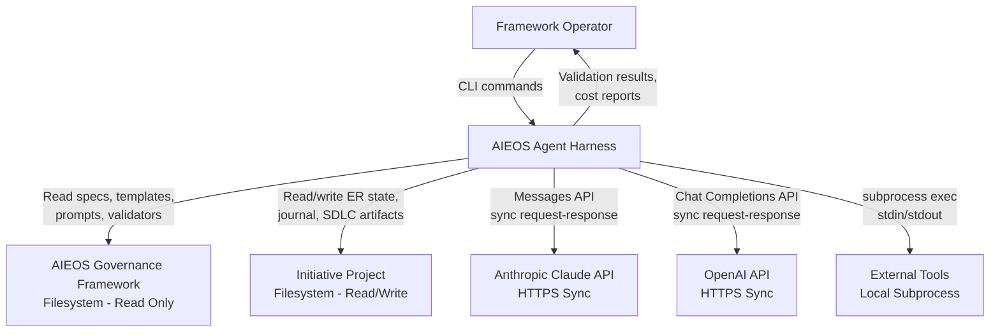
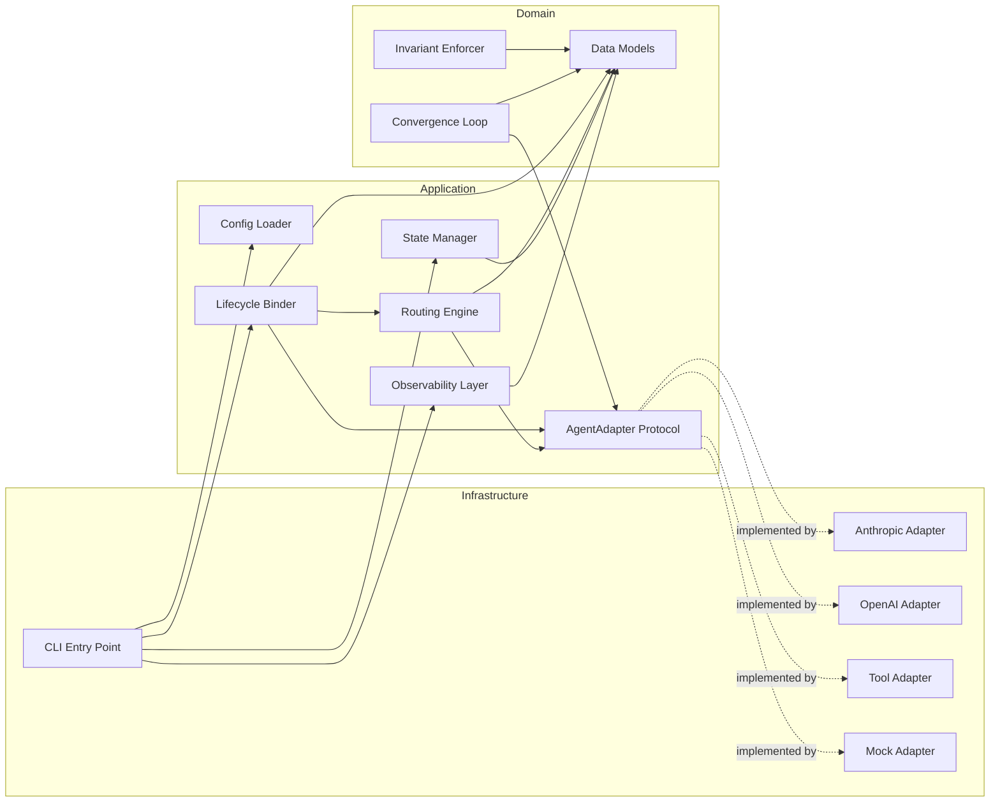
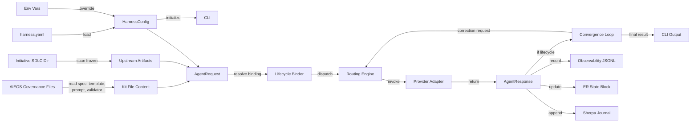

# SAD: AIEOS Agent Harness

## 0. document control
- System Name: AIEOS Agent Harness
- SAD ID: SAD-HARNESS-001
- Author: Todd Linnertz (extracted from existing codebase by AI)
- Date: 2026-03-26
- Status: Draft
- Governance Model Version: 1.3
- Prompt Version: sad-prompt v1.0
- Spec Version: sad-spec v1.1
- Principles Version: N/A (no ACF or principles files exist for this system project; constraints are documented in PRD-HARNESS-001 Section 6)
- Upstream Artifacts:
  - PRD ID / Link: PRD-HARNESS-001 (docs/sdlc/03-prd.md)
  - ACF ID / Link: N/A (retroactive governance; no ACF produced — PRD Section 6 Constraints serves as the guardrail source)
- Related ADRs: None (architectural decisions are embedded in the codebase; documented in Section 5 below)

**Note:** This SAD is retroactive. The system described below is fully implemented. All architectural descriptions reflect the actual codebase (14 source files, 166 tests). No ACF exists because this is an system software project governed retroactively; the PRD constraints (C-1 through C-6) serve as the guardrail equivalent.

---

## 1. intent summary

From PRD-HARNESS-001:

- The AIEOS governance framework defines a structured artifact lifecycle across 16 layers but provides no automation layer to orchestrate AI-assisted artifact production
- Manual orchestration of artifact generation and validation is error-prone and unscalable as the framework grows (16 layers, 30+ artifact types, 5 initiative presets)
- The system automates the generate-validate cycle for any AIEOS artifact type via a single CLI command (G-1)
- All 7 AIEOS structural invariants are enforced programmatically on every invocation, removing reliance on operator memory (G-2)
- Requests are routed across multiple AI providers with automatic failover, circuit breaking, and cost optimization (G-3)
- Failed validations trigger bounded automatic re-generation with correction constraints, defaulting to 3 iterations maximum (G-4)
- Every invocation records cost, latency, token usage, and result to a persistent JSONL log (G-5)
- The system is CLI-only with no graphical interface (NG-1)
- All state is stored on disk as Markdown and JSONL with no database (NG-2)
- The system never auto-freezes artifacts; the freeze decision is always a human action (NG-3)
- The harness consumes AIEOS governance files as read-only inputs and never modifies them (NG-4)

---

## 2. scope and non-Goals (Hard boundary)

### In scope

- Lifecycle event binding: mapping lifecycle events to adapter invocations via YAML-configured bindings
- Multi-strategy routing engine with 4 strategies (fallback, pipeline, parallel_consensus, cost_aware) and circuit breaker protection
- Bounded convergence loop with staleness and oscillation detection
- 7 programmatic invariant checks enforced on every invocation
- Provider adapter layer with Protocol-based plugin interface (Anthropic, OpenAI, Tool, Mock implementations)
- Disk-based state management for Engagement Record state blocks and Sherpa Journal entries
- Per-invocation JSONL observability with cost summary, provider health summary, and anomaly detection
- CLI with 5 subcommands (generate, validate, lifecycle, health, costs)
- Configuration via YAML file with environment variable overrides for credentials and paths

### Explicit non-Goals

- No graphical user interface (NG-1)
- No database backend (NG-2)
- No auto-freeze capability (NG-3)
- No governance file modification (NG-4)
- No multi-tenant operation (NG-5)
- No agent memory or context persistence across invocations (NG-6)
- No real-time streaming (NG-7)
- No multi-initiative orchestration
- No prompt engineering or optimization
- No artifact content quality judgment beyond structural invariant checks
- No provider billing or account management
- No adapter hot-reload

Anything not listed as in-scope is out of scope by default.

---

## 3. system context (Black box)

### Responsibilities

- Accept CLI commands specifying artifact type, initiative path, and operation (generate, validate, lifecycle, health, costs)
- Resolve the correct spec, template, prompt, and validator files from the AIEOS governance framework for the requested artifact type
- Collect frozen upstream artifacts from the initiative project's SDLC directory
- Dispatch requests to configured AI provider adapters using the selected routing strategy
- Enforce 7 AIEOS structural invariants before and during operations
- Run bounded convergence loops when validation fails, building correction requests from blocking issues
- Record per-invocation metrics to a JSONL observability log
- Read and write Engagement Record state blocks and Sherpa Journal entries on disk
- Present validation results for human freeze decision without auto-promoting artifacts

### External actors / systems

- Upstream: AIEOS Governance Framework (filesystem) — provides spec, template, prompt, and validator Markdown files, read-only
- Upstream: Initiative Project (filesystem) — provides SDLC artifacts, Engagement Record, and Sherpa Journal as Markdown files on disk
- Downstream: AI Provider APIs (network) — Anthropic Claude Messages API and OpenAI Chat Completions API, synchronous request-response over HTTPS
- Downstream: External Tools (subprocess) — SAST scanners, linters, and validators invoked as local subprocesses
- Users/Clients: Framework Operator (CLI) — invokes commands, reviews results, makes freeze decisions

### Trust boundaries

- TB-1: Harness-to-Provider API boundary. API keys cross this boundary via HTTPS. Keys are read from environment variables; never stored in configuration files or passed through governance content.
- TB-2: Harness-to-subprocess boundary. The Tool adapter invokes external commands via subprocess. The harness writes artifact content to temp files and passes file paths as arguments. Temp files are cleaned up in a finally block.

### Diagrams

---

## 4. high-Level architecture (White box)

### Major components

**Config Loader** (`src/config.py`)
- Responsibility: Load configuration from YAML file, apply environment variable overrides for AIEOS_ROOT, AIEOS_INITIATIVE_ROOT, read API keys exclusively from environment variables. Produce a typed HarnessConfig dataclass.
- Key interactions: Consumed by CLI to initialize all other components. Provides ProviderConfig, RoutingConfig, and binding definitions.
- Dependencies: PyYAML for YAML parsing, os module for environment variable access.

**Data Models** (`src/models.py`)
- Responsibility: Define the canonical data structures shared across all components. Includes AgentRequest (9 fields), AgentResponse (12 fields with provenance), ValidationResult (6 fields), ERStateBlock (7 fields), InvocationRecord (15 fields), ConvergenceState (5 fields), InvariantCheck (3 fields), and 6 enums (ArtifactStatus, LifecycleEvent, RoutingStrategy, HealthStatus, DecisionOutcome).
- Key interactions: Imported by every other module as the shared vocabulary.
- Dependencies: Python standard library only (dataclasses, enum).

**Lifecycle Binder** (`src/lifecycle.py`)
- Responsibility: Map lifecycle events (PRE_GENERATION, POST_GENERATION, PRE_VALIDATION, POST_VALIDATION, POST_FREEZE, ON_FAILURE) combined with artifact type to adapter invocations. Resolve exact artifact type matches before wildcard ("*") bindings. Execute dispatch to the first matching adapter.
- Key interactions: Receives EventBinding definitions from Config Loader. References adapter instances from the adapter registry. Returns AgentResponse from adapter invocation.
- Dependencies: AgentAdapter protocol, Data Models.

**Routing Engine** (`src/routing.py`)
- Responsibility: Dispatch requests through adapters using one of 4 strategies (fallback, pipeline, parallel_consensus, cost_aware). Maintain per-provider circuit breaker state (opens after configurable consecutive failures, auto-resets after configurable timeout).
- Key interactions: Receives adapter lists from Lifecycle Binder. Invokes AgentAdapter.invoke() on selected adapters. Uses ThreadPoolExecutor for parallel_consensus fan-out.
- Dependencies: AgentAdapter protocol, Data Models, concurrent.futures for thread-based parallelism.

**Convergence Loop** (`src/convergence.py`)
- Responsibility: Run bounded generate-validate cycles. Parse validation responses (JSON extraction from fenced code blocks or raw JSON). Detect staleness (same gate failing with same description in consecutive iterations) and oscillation (gate failing, passing, failing across 3 iterations). Build correction requests from blocking issues. Maintain convergence ledger.
- Key interactions: Invokes generate adapter and validate adapter as separate calls with no shared session state. Produces ConvergenceState with full ledger.
- Dependencies: AgentAdapter protocol, Data Models.

**State Manager** (`src/state.py`)
- Responsibility: Read and write Engagement Record state blocks by parsing and replacing field/value tables in Markdown. Scan docs/sdlc/*.md for frozen artifacts by extracting Artifact ID and Status from Document Control tables. Append and parse Sherpa Journal entries as Markdown sections with timestamp and field/value tables.
- Key interactions: Called by CLI and invariant checks to read current initiative state. Writes to ER and Journal files on disk.
- Dependencies: Data Models, Python pathlib and re for file I/O and Markdown parsing.

**Invariant Enforcer** (`src/invariants.py`)
- Responsibility: Implement 7 pure-function invariant checks: (1) generation/validation separation, (2) freeze-before-promote using a 30+ entry upstream dependency map, (3) human freeze decision, (4) bounded convergence, (5) validator output format with suggestion language rejection, (6) tool-agnostic policy scanning for provider-specific terms, (7) disk-based state verification.
- Key interactions: Calls State Manager's read_frozen_artifacts() for freeze-before-promote checks. Returns InvariantCheck results (name, passed, reason).
- Dependencies: Data Models, State Manager (for frozen artifact scanning).

**Observability Layer** (`src/observability.py`)
- Responsibility: Record per-invocation metrics as JSON lines to a JSONL file. Provide aggregation queries: cost summary by provider and by artifact type with optional initiative filtering, provider health summary with failure rate thresholds (OK/DEGRADED/DOWN), and cost anomaly detection (flags invocations exceeding 3x rolling mean within configurable lookback window).
- Key interactions: Called by CLI after each invocation to record metrics. Queried by health and costs subcommands.
- Dependencies: Data Models, Python json and statistics modules.

**CLI** (`src/cli.py`)
- Responsibility: Parse command-line arguments (argparse). Provide 5 subcommands: generate (resolve kit files, collect upstream, invoke adapter), validate (infer type from filename, locate validator, invoke adapter), lifecycle (generate then validate in sequence, present for human freeze), health (check provider status and historical metrics), costs (display cost summary). Build adapter instances from config with lazy SDK imports.
- Key interactions: Orchestrates Config Loader, adapter construction, kit file resolution, upstream artifact collection, adapter invocation, and Observability Layer queries.
- Dependencies: Config Loader, Data Models, Observability Layer, Adapter implementations (lazily imported).

**Adapter Protocol** (`src/adapters/base.py`)
- Responsibility: Define the AgentAdapter Protocol interface: provider_name property, model_name property, invoke(request) method, health() method, cost_estimate(request) method. Decorated with @runtime_checkable for structural subtyping.
- Key interactions: All adapter implementations conform to this protocol. Referenced by Lifecycle Binder, Routing Engine, and Convergence Loop.
- Dependencies: Data Models (AgentRequest, AgentResponse, HealthStatus).

**Anthropic Adapter** (`src/adapters/anthropic.py`)
- Responsibility: Implement AgentAdapter for the Anthropic Claude Messages API. Build system/user messages from AgentRequest fields. Track token usage and compute cost using per-model pricing tables. Compute SHA-256 input content hash for provenance. Lazily initialize SDK client on first use.
- Key interactions: Called by Routing Engine or Lifecycle Binder via invoke(). Reads ANTHROPIC_API_KEY from environment.
- Dependencies: Anthropic SDK (lazy import), Data Models.

**OpenAI Adapter** (`src/adapters/openai.py`)
- Responsibility: Implement AgentAdapter for the OpenAI Chat Completions API. Build system/user messages from AgentRequest fields. Track token usage and compute cost using per-model pricing tables. Compute SHA-256 input content hash for provenance. Lazily initialize SDK client on first use.
- Key interactions: Called by Routing Engine or Lifecycle Binder via invoke(). Reads OPENAI_API_KEY from environment.
- Dependencies: OpenAI SDK (lazy import), Data Models.

**Tool Adapter** (`src/adapters/tool.py`)
- Responsibility: Run external commands as subprocesses. Write current artifact to a temp file when present and pass file path as argument. Capture stdout as response content. Handle timeouts and command-not-found errors gracefully. Report zero cost. Clean up temp files in finally block.
- Key interactions: Called by Routing Engine or Lifecycle Binder via invoke(). Executes local commands via subprocess.run().
- Dependencies: Data Models, Python subprocess and tempfile modules.

**Mock Adapter** (`src/adapters/mock.py`)
- Responsibility: Test double implementing AgentAdapter protocol. Supports preset responses per artifact type, configurable health status, configurable failure behavior, and call history recording for test assertions.
- Key interactions: Used exclusively in tests. Conforms to AgentAdapter protocol.
- Dependencies: Data Models.

### Layer assignment

**Dependency Direction Rule:** Source code dependencies point inward only. Infrastructure depends on Application. Application depends on Domain. Domain depends on nothing external.

| Component | Layer | Justification |
|-----------|-------|---------------|
| Data Models | Domain | Defines core entities (AgentRequest, AgentResponse, ValidationResult, enums) with no external dependencies; pure Python dataclasses and enums |
| Invariant Enforcer | Domain | Pure-function invariant checks operating on domain types; depends only on Data Models and State Manager's read interface |
| Convergence Loop | Domain | Implements bounded correction logic using domain types; depends on AgentAdapter protocol (abstraction), not concrete adapters |
| Adapter Protocol | Application | Defines the AgentAdapter interface (Protocol) that infrastructure adapters implement; bridges domain and infrastructure |
| Lifecycle Binder | Application | Orchestrates event-to-adapter mapping and dispatch; depends on AgentAdapter abstraction and domain models |
| Routing Engine | Application | Implements 4 routing strategies and circuit breaker; depends on AgentAdapter abstraction and domain models |
| Config Loader | Application | Translates external configuration (YAML, env vars) into typed domain objects (HarnessConfig) |
| Observability Layer | Application | Aggregates domain InvocationRecord objects; writes to JSONL (infrastructure concern isolated to file I/O) |
| State Manager | Application | Translates between Markdown file format and domain ERStateBlock/ArtifactStatus types; bridges domain and filesystem |
| CLI | Infrastructure | Entry point; depends on all application and domain components; handles argparse, stdout, file resolution |
| Anthropic Adapter | Infrastructure | Implements AgentAdapter protocol using Anthropic SDK; provider-specific API calls and pricing |
| OpenAI Adapter | Infrastructure | Implements AgentAdapter protocol using OpenAI SDK; provider-specific API calls and pricing |
| Tool Adapter | Infrastructure | Implements AgentAdapter protocol using subprocess execution; OS-level process management |
| Mock Adapter | Infrastructure | Test infrastructure implementing AgentAdapter protocol |

Components that span layers:
- State Manager spans Application and Infrastructure: it defines application-level functions (read_er_state_block, read_frozen_artifacts) but performs infrastructure-level file I/O and regex parsing. The domain types it produces (ERStateBlock, ArtifactStatus) are pure domain objects. This is acceptable because there is no separate persistence abstraction layer; the Markdown file format is the system's only persistence mechanism by design (NG-2, C-5).

### Communication patterns

- Sync: All adapter invocations are synchronous request-response. No async I/O, no streaming, no message queues.
- Thread parallelism: parallel_consensus strategy uses ThreadPoolExecutor to fan out to all adapters concurrently. All other strategies are single-threaded sequential.
- Protocols: HTTPS for AI provider APIs (Anthropic Messages API, OpenAI Chat Completions API). Local subprocess exec for Tool adapter. Filesystem read/write for state management and governance file access.
- High-level data flow: YAML config + env vars produce HarnessConfig. CLI resolves kit files from AIEOS governance filesystem. CLI collects frozen upstream artifacts from initiative filesystem. AgentRequest is constructed from config, kit files, and upstream artifacts. Request flows through Lifecycle Binder to Routing Engine to Adapter. Adapter returns AgentResponse. Response flows to Convergence Loop (if lifecycle command) or directly to CLI output. State Manager updates ER and journal. Observability Layer records InvocationRecord to JSONL.

### Diagrams

---

## 5. key architectural decisions

- **Decision: Protocol-based adapter interface instead of abstract base class.**
  - Rationale: Python's Protocol (PEP 544) enables structural subtyping: adapters satisfy the interface by implementing the required methods without inheriting from a base class. This reduces coupling and allows third-party adapters to conform without importing harness code. Supports the PRD requirement for a pluggable adapter layer (FR-27).
  - Alternatives considered: Abstract base class (ABC) with abstract methods. Rejected because it requires inheritance, creating a tighter coupling between the harness and adapter implementations.
  - Consequences: Adapters are checked at runtime via @runtime_checkable. No compile-time enforcement. Adapter authors must know the protocol shape.

- **Decision: No database: all state on Markdown and JSONL files.**
  - Rationale: Directly supports PRD constraint C-5 (no in-memory state) and non-goal NG-2. The AIEOS framework is Markdown-native; the harness stores state in the same format as the artifacts it manages. ER state blocks are parsed from and written to existing ER Markdown files. Metrics use append-only JSONL for simplicity and auditability.
  - Alternatives considered: SQLite for metrics and state. Rejected because it adds a dependency that provides no benefit for single-operator, single-machine use. The append-only JSONL pattern is sufficient for the observability queries implemented.
  - Consequences: No concurrent write safety. Aggregation queries read the full log file on every call. Acceptable for single-operator usage per NG-5.

- **Decision: YAML configuration with environment variable overrides for credentials.**
  - Rationale: YAML provides human-readable configuration for bindings, routing, and provider settings. API keys are read exclusively from environment variables (C-1) to prevent credential leakage into version-controlled files. AIEOS_ROOT and AIEOS_INITIATIVE_ROOT can override YAML values via environment variables for deployment flexibility.
  - Alternatives considered: TOML configuration. Environment-only configuration. JSON configuration. YAML was chosen for readability and familiarity in the Python system.
  - Consequences: PyYAML is a runtime dependency. Configuration schema is not formally validated beyond what load_config() checks.

- **Decision: ThreadPoolExecutor for parallel consensus, not asyncio.**
  - Rationale: The parallel_consensus routing strategy fans out to all adapters concurrently. ThreadPoolExecutor provides sufficient parallelism for the expected adapter count (2-4 concurrent providers) without requiring an async runtime. The Anthropic and OpenAI SDKs provide synchronous clients that work naturally with threads.
  - Alternatives considered: asyncio with async adapter interface. Rejected because it would require all adapters to implement async invoke(), complicating the protocol and the Tool adapter (subprocess is inherently synchronous).
  - Consequences: Thread count is bounded by adapter count per invocation. No event loop overhead. The GIL is not a bottleneck because adapter invocations are I/O-bound (network calls or subprocess waits).

- **Decision: Correction as re-generation, not in-place editing.**
  - Rationale: When validation fails, the convergence loop builds a new AgentRequest with blocking issues appended as correction constraints and re-invokes the generate adapter from scratch. This maintains the invariant that generation and validation are always separate stateless invocations (C-2, FR-15). Each iteration produces a complete artifact, not a patch.
  - Alternatives considered: In-place editing where the LLM receives the failed artifact and specific edit instructions. Rejected because it would create implicit session state between generation and correction, violating the stateless invocation model.
  - Consequences: Each correction iteration consumes a full generation's worth of tokens. Cost increases linearly with iteration count. Bounded to 3 iterations by default to control cost.

- **Decision: Lazy SDK initialization.**
  - Rationale: Provider SDK clients (Anthropic, OpenAI) are initialized on first invoke(), not at adapter construction time (FR-31). This allows the harness to be configured with multiple providers without requiring all API keys to be present. Unused providers incur no initialization cost.
  - Alternatives considered: Eager initialization at construction. Rejected because it would fail at startup if any configured provider's API key is missing, even if that provider is not used for the current operation.
  - Consequences: First invocation of each provider incurs SDK initialization overhead. Import errors surface at invocation time, not at configuration time.

---

## 6. cross-Cutting concerns (Architectural handling)

### Security

- Trust boundary TB-1 (Harness-to-Provider API): API keys cross this boundary via HTTPS. Keys are sourced exclusively from environment variables (ANTHROPIC_API_KEY, OPENAI_API_KEY) per constraint C-1. The Config Loader never reads credentials from the YAML file. No credential is stored in any source file, configuration file, or log entry.
- Trust boundary TB-2 (Harness-to-Subprocess): The Tool adapter writes artifact content to a temp file (tempfile.NamedTemporaryFile with delete=False) and passes the path as a command argument. The temp file is cleaned up in a finally block. The command to execute is specified in configuration, not derived from user input at runtime.
- No authentication or authorization within the harness itself. The system is single-operator on a single machine (NG-5). Access control is delegated to the operating system (file permissions, environment variable access).
- The tool-agnostic policy invariant (Invariant 6) scans governance content for provider-specific terms to prevent information leakage from harness operations into governance files.

### Reliability and resilience

- Circuit breaker: Each provider has an independent CircuitBreaker instance that opens after a configurable number of consecutive failures (default 3) and auto-resets after a configurable timeout (default 60 seconds). When open, the provider is skipped in fallback and cost-aware routing, directing traffic to healthy alternatives.
- Fallback routing: The fallback strategy tries adapters in configured order, skipping those with open circuit breakers, providing automatic failover when a provider is unavailable.
- Bounded convergence: The convergence loop enforces a configurable maximum iteration count (default 3). Staleness detection warns when the same gate fails with the same description in consecutive iterations. Oscillation detection warns when a gate alternates between pass and fail across 3 iterations. Both prevent unbounded retry loops.
- Graceful error handling: Provider adapters catch timeouts, API errors, and command-not-found conditions, returning structured error information in AgentResponse rather than propagating unhandled exceptions.

### Observability

- Per-invocation metrics: Every adapter invocation produces an InvocationRecord with 15 fields (timestamp, artifact_type, artifact_id, event, provider, model, strategy, tokens_in, tokens_out, cost_usd, latency_ms, result, validation_status, convergence_iteration, error) recorded as a JSON line to the observability log.
- Cost summary: Aggregation by provider and by artifact type, with optional initiative filtering.
- Provider health summary: Total invocations, failure count, average latency, and derived status (OK if zero failures, DEGRADED if failure rate below 50%, DOWN if at or above 50%).
- Cost anomaly detection: Flags invocations whose cost exceeds 3x the rolling mean for the same artifact type within a configurable lookback window (default 24 hours).
- Convergence ledger: Each convergence loop iteration records status, hard gate results, blocking issues, and completeness score to a ConvergenceState ledger for post-hoc analysis.

### Performance and scale

- Single-operator model: The system is designed for one operator on one machine (NG-5). No concurrent request handling, no horizontal scaling, no load balancing.
- I/O-bound workload: The performance bottleneck is AI provider API latency (seconds to tens of seconds per invocation), not local computation. Local operations (config loading, file parsing, invariant checks) complete in milliseconds.
- Thread parallelism for consensus: The parallel_consensus strategy uses ThreadPoolExecutor bounded to the number of adapters (typically 2-4) to minimize wall-clock time for multi-provider fan-out.
- Lazy initialization: SDK clients and module imports are deferred until first use, keeping startup time proportional to the operation requested rather than the number of configured providers.

---

## 7. data and integration

### Data stores

**YAML Configuration File** (harness.yaml)
- Ownership: Framework Operator (write authority). Config Loader (read-only consumer).
- Access pattern: Read once at CLI startup. Never written by the harness.

**AIEOS Governance Files** (specs, templates, prompts, validators across kit directories)
- Ownership: AIEOS Governance Framework (write authority). Harness (read-only consumer per C-4).
- Access pattern: Read during kit file resolution at the start of generate, validate, and lifecycle commands. Never written by the harness.

**Initiative SDLC Directory** (docs/sdlc/*.md)
- Ownership: Framework Operator and harness jointly. Operator creates and freezes artifacts. Harness reads frozen artifacts as upstream inputs.
- Access pattern: Read via glob scan to extract Artifact ID and Status from Document Control tables. Read for frozen artifact content collection.

**Engagement Record** (docs/engagement/er-*.md)
- Ownership: State Manager (write authority for the state block table in section 1b). Framework Operator (write authority for all other sections).
- Access pattern: Read via regex parsing of | Field | Value | table rows. Write via in-place regex replacement of field values.

**Sherpa Journal** (Markdown file)
- Ownership: State Manager (write authority: append only). Framework Operator (read).
- Access pattern: Append-only writes of formatted Markdown sections with timestamp and field/value tables. Read via ### header splitting and table row parsing.

**Observability Log** (harness-metrics.jsonl)
- Ownership: Observability Layer (write authority: append only).
- Access pattern: Append one JSON line per invocation. Read all lines for aggregation queries (cost summary, health summary, anomaly detection). Full file scan on each read query.

### Integration patterns

- Filesystem-as-integration: The harness integrates with AIEOS governance files and initiative projects entirely through filesystem reads. Kit file resolution iterates over aieos-* directories under AIEOS_ROOT, looking for matching spec/template/prompt/validator files by naming convention. This is a loose coupling pattern: the harness has no compile-time dependency on any specific kit.
- Provider API integration: Each LLM adapter encapsulates a single provider's API. The adapter builds system and user messages from AgentRequest fields, calls the provider API synchronously, extracts response content and token usage, computes cost from pricing tables, and returns a normalized AgentResponse. Provider-specific details (message format, token counting, pricing) are fully contained within the adapter.
- Subprocess integration: The Tool adapter integrates with external tools via subprocess.run(). The harness writes the current artifact to a temp file, passes the file path as the last command argument, and captures stdout as the response content.

### Integration contracts

| Integration Point | Service A | Service B | Expected Inputs | Expected Outputs | Error Modes | Versioning Strategy |
|-------------------|-----------|-----------|----------------|-----------------|-------------|-------------------|
| Anthropic Messages API | Agent Harness (Anthropic Adapter) | Anthropic API | System message (string), user message (string), model name, max_tokens | Response with content blocks, usage (input_tokens, output_tokens), id, stop_reason | API key invalid, rate limit, model not found, network timeout | Model name includes date suffix (e.g., claude-sonnet-4-20250514); pricing table keyed by model name |
| OpenAI Chat Completions API | Agent Harness (OpenAI Adapter) | OpenAI API | Messages array (system + user roles), model name, max_tokens | Response with choices[0].message.content, usage (prompt_tokens, completion_tokens), id, finish_reason | API key invalid, rate limit, model not found, network timeout | Model name as version identifier; pricing table keyed by model name |

*Internal component interactions within the harness are exempt from this table.*

### State transitions

- **Artifact lifecycle states:** DRAFT -> VALIDATED -> FREEZE_PENDING -> FROZEN. The harness reads these states from Document Control tables in SDLC files. The harness never writes artifact status: it only reads status to check frozen upstream dependencies (Invariant 2).
- **ER state block transitions:** The State Manager reads and writes the 7 fields of the state block (Current Layer, Current Artifact, Current Step, Frozen Count, Next Action, Blocking On, Last Updated) in-place. Transitions are driven by CLI operations: when a generation or validation completes, the state block is updated to reflect the new position in the artifact lifecycle.
- **Circuit breaker states:** CLOSED (normal) -> OPEN (after max consecutive failures) -> HALF-OPEN (after reset timeout expires, allows one retry) -> CLOSED (on success) or OPEN (on failure). Managed per provider by the CircuitBreaker class.
- **Convergence states:** Each iteration transitions through: generate -> validate -> parse result -> (PASS: return) or (FAIL: check staleness/oscillation, build correction, re-generate). Terminal states: PASS (validation succeeded) or escalation needed (max iterations reached without PASS).

---

## 8. failure modes and recovery

| Failure Mode | Impact | Detection | Mitigation |
|-------------|--------|-----------|------------|
| AI provider API unavailable | Generation or validation cannot complete for the affected provider | CircuitBreaker tracks consecutive failures; health() check returns DOWN | Fallback routing skips providers with open circuit breakers and tries the next adapter in order. Circuit breaker auto-resets after configurable timeout (default 60s) to re-test the provider. |
| AI provider returns malformed validation JSON | Convergence loop cannot parse validation result; iteration wasted | parse_validation_result() raises ValueError when JSON extraction fails or required fields are missing | Convergence loop catches parse failure and treats iteration as failed. Correction constraints from the previous iteration carry forward. Bounded to max_iterations to prevent infinite retry. |
| Convergence staleness (same gate fails repeatedly) | Remaining iterations are unlikely to resolve the issue; cost is wasted on re-generation | _detect_staleness() compares blocking issues across consecutive ledger entries; logs warning when same gate fails with identical description | Warning logged to alert operator. Convergence continues to max_iterations but the warning signals that manual intervention may be needed. The ledger preserves full iteration history for diagnosis. |
| Convergence oscillation (gate alternates pass/fail) | System cannot stabilize; iterations consumed without progress | _detect_oscillation() checks 3-iteration window for gate flip-flop pattern; logs warning | Warning logged. Convergence continues to bound. Oscillation pattern in ledger provides diagnostic evidence for the operator to adjust the generation prompt or spec. |
| Missing upstream frozen artifact | Invariant 2 (freeze-before-promote) violation; downstream generation would produce an artifact based on unfrozen upstream | check_freeze_before_promote() scans SDLC directory for frozen artifact types matching the upstream dependency map | Generation is blocked before it starts. InvariantCheck returns passed=False with the list of missing frozen upstream artifacts. Operator must freeze upstream artifacts before retrying. |
| API key missing from environment | Provider adapter cannot authenticate; invocation fails | health() returns DOWN when API key is empty string. Lazy client initialization would fail on first invoke(). | Fallback routing skips DOWN providers. CLI reports the error. Operator must set the environment variable. |
| External tool command not found | Tool adapter cannot invoke the specified command | FileNotFoundError caught in Tool adapter invoke(); health() returns DOWN when shutil.which() returns None | Tool adapter returns structured error response (content describes the error, raw_response contains {"error": "command_not_found"}). Operation does not crash. |
| External tool timeout | Tool adapter subprocess exceeds configured timeout | subprocess.TimeoutExpired caught in Tool adapter invoke() | Tool adapter returns structured error response with timeout description. Default timeout is 300 seconds, configurable per tool. |

---

## 9. quality attribute scenarios (QAS)

| Quality Attribute | Scenario | Response | Measure |
|------------------|----------|----------|---------|
| Reliability | Primary AI provider becomes unavailable during a lifecycle operation | Circuit breaker opens after 3 consecutive failures; fallback routing redirects to the next configured provider; operation completes via alternate provider | Operation succeeds without manual intervention when at least one provider is healthy |
| Correctness | Operator attempts to generate a SAD without a frozen PRD upstream | Invariant Enforcer's check_freeze_before_promote() detects missing frozen PRD; generation is blocked before any provider invocation | Generation does not proceed; operator receives explicit message identifying missing frozen upstream artifact |
| Cost Efficiency | Operator runs cost-aware routing with 3 providers at different price points | Routing engine sorts adapters by cost_estimate() ascending and invokes the cheapest available adapter (circuit breaker not open) | The lowest-cost healthy provider is always selected first |
| Testability | Developer runs the full test suite without any AI provider API keys configured | All 166 tests pass using MockAdapter; no test requires network access or real provider credentials | Zero test failures with no API keys set; verified by pytest -v |
| Operability | Operator reviews cost and health across a multi-day initiative | costs subcommand aggregates JSONL records by provider and artifact type; health subcommand shows current provider status and historical failure rates | Cost and health data available from CLI without external tooling |
| Resilience | Validation fails 3 consecutive times in a convergence loop | Convergence loop terminates at max_iterations; convergence ledger contains full iteration history (status, hard gates, blocking issues, completeness score per iteration); result returned for operator review | Loop terminates within bound; ledger provides complete diagnostic trail |
| Safety | Convergence loop or CLI operation could auto-freeze an artifact | check_human_freeze_decision() invariant rejects any auto_freeze_attempted=True flag; lifecycle subcommand prints "Freeze? (harness does not auto-freeze)" and returns | No artifact status is ever changed to FROZEN by the harness |

---

## 10. constraints and guardrails (from ACF)

No formal ACF exists for this system project. The following constraints from PRD-HARNESS-001 Section 6 serve as the guardrail equivalent. All are enforced in the implemented architecture:

- C-1: No credentials in configuration files. Enforced by Config Loader reading API keys exclusively from environment variables. The YAML parser ignores any key-like fields in the configuration file.
- C-2: No combined generation and validation. Enforced by the Convergence Loop always issuing separate invoke() calls for generation and validation. Enforced programmatically by Invariant 1 (check_generation_validation_separation).
- C-3: No auto-promotion. Enforced by Invariant 3 (check_human_freeze_decision). The lifecycle CLI subcommand presents results and stops without modifying artifact status.
- C-4: No governance file mutation. The harness opens governance files in read-only mode. No write operations target any file under AIEOS_ROOT kit directories.
- C-5: No in-memory state. The system of record is on disk. ER state blocks, journal entries, and observability metrics are persisted to files. Invariant 7 (check_disk_based_state) verifies that ER and journal files exist.
- C-6: No provider-specific logic in core modules. Provider-specific code (API calls, message formatting, pricing tables, SDK imports) resides exclusively in adapter implementations under src/adapters/. Core modules reference the AgentAdapter Protocol, not concrete adapter classes. Invariant 6 (check_tool_agnostic_policy) scans governance content for provider-specific terms.

---

## 11. deferred decisions (Explicit)

- **Per-artifact-type convergence limits:** Currently, max_convergence_iterations is a global setting (default 3). Per-artifact-type configuration was identified in PRD Q-1 but deferred because the global default has been sufficient for all tested artifact types. Target resolution: next enhancement cycle if operator feedback indicates artifact types with different convergence characteristics.

- **External monitoring export:** The observability layer records to JSONL only. Export to external monitoring systems (Prometheus, OpenTelemetry) was identified in PRD Q-2 but deferred because the single-operator usage model does not require real-time dashboarding. Target resolution: when multi-operator or CI/CD integration is considered.

- **Tool adapter structured output parsing:** The Tool adapter captures raw stdout as response content. Structured JSON output parsing was identified in PRD Q-3 but deferred because current tool integrations (SAST, linters) produce human-readable output that does not require structured parsing. Target resolution: when a tool integration requires machine-readable output for downstream processing.

- **Configuration schema validation:** The Config Loader does not formally validate the YAML schema beyond field extraction. Invalid configuration keys are silently ignored. Deferred because the configuration surface area is small and operator-managed. Target resolution: when configuration complexity grows or when automated deployment pipelines require schema validation.

- **Formal ACF production:** This SAD references PRD constraints as guardrails because no ACF was produced for this retroactive governance engagement. Deferred because the project is fully implemented and the constraints are already enforced in code. Target resolution: if the project enters a new development phase that requires architectural decisions beyond the current implementation.

---

## 12. risks and assumptions

### Risks

- **R-1: Upstream dependency map drift.** The UPSTREAM_DEPENDENCIES map in src/invariants.py contains 30+ artifact type relationships that must match the AIEOS governance model. If the governance model adds new artifact types or changes dependency chains, the map becomes stale and freeze-before-promote checks may produce false positives or false negatives.
  - Impact: Incorrect invariant enforcement: either blocking valid operations or allowing invalid ones.
  - Mitigation: The dependency map is a single dictionary in one file, making it straightforward to update. The 166-test suite includes tests for freeze-before-promote with specific artifact types. When new kits are added to the governance framework, the map must be updated as part of the kit integration.

- **R-2: Full-file read for observability queries.** The ObservabilityLayer reads the entire JSONL log file on every aggregation query (cost_summary, provider_health_summary, detect_cost_anomaly). As the log grows over months of usage, query latency will increase linearly.
  - Impact: Degraded CLI responsiveness for health and costs subcommands after extended use.
  - Mitigation: The log is append-only and can be rotated or truncated by the operator without architectural change. The detect_cost_anomaly method accepts a configurable lookback window (default 24 hours) that naturally limits the relevant record set. If needed, the JSONL file can be partitioned by time period without changing the architecture.

- **R-3: Token estimation accuracy.** The cost_estimate() methods in LLM adapters use a rough heuristic (1 token per 4 characters) for pre-invocation cost estimation. Actual token counts may differ significantly, especially for non-English content or code-heavy prompts.
  - Impact: Cost-aware routing may not select the truly cheapest provider when estimates diverge from actuals.
  - Mitigation: Actual costs are always recorded post-invocation in the observability log. The cost_estimate is used only for routing ordering, not for billing. The operator can review actual vs. estimated costs in the cost summary.

### Assumptions

- **A-1:** The AIEOS governance framework is available at a filesystem path reachable from the harness process. If false, no kit file resolution can occur and generate/lifecycle commands will fail.
- **A-2:** Initiative projects follow AIEOS directory conventions (docs/sdlc/*.md for artifacts, docs/engagement/er-*.md for Engagement Records, Sherpa Journal as Markdown). If false, state management and frozen artifact scanning will not function.
- **A-3:** At least one AI provider API key is set as an environment variable when using LLM adapters. If false, the harness can only use the Tool adapter and Mock adapter.
- **A-4:** External tools invoked by the Tool adapter are installed and available on the system PATH. If false, the Tool adapter's health check will report DOWN and invocations will return command-not-found errors.
- **A-5:** The upstream dependency map in src/invariants.py accurately reflects the current AIEOS governance model. If false, freeze-before-promote checks may be incorrect (see R-1).

---

## 13. freeze declaration (when ready)

This SAD documents the existing AIEOS Agent Harness (ECO-009) architecture retroactively. All architectural descriptions reflect the implemented codebase.

- Approved By: _pending_
- Date: _pending_

<!-- Elicitation: Pre-Mortem Analysis applied. Key insight: the most likely architectural failure is upstream dependency map drift (R-1) when new AIEOS kits are added, because the map is a hardcoded dictionary that must be manually synchronized with the governance model's freeze-before-promote rules. -->
